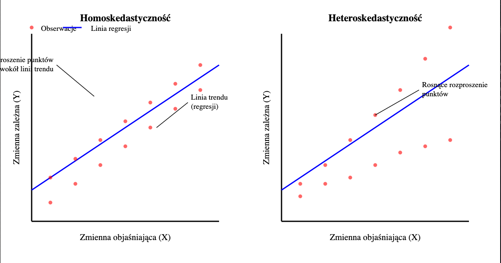
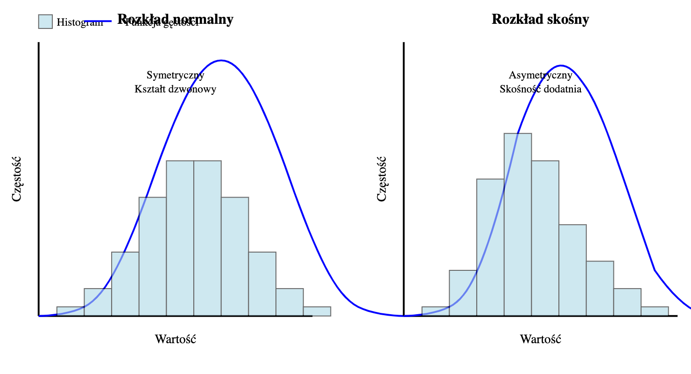

# Rodzaje danych i metody analizy

## Dane ciągłe

### Jakie to dane?

Dane numeryczne, które mogą przyjmować dowolną wartość a określonym przedziale.

### Przykłady metod

- Analiza korelacji: Badanie siły i kierunku związku między zmiennymi (np. współczynnik korelacji Pearsona)
- Regresja liniowa: Modelowanie relacji między zmienną zależną, a niezależnymi.
    - Technika, która pozwala opisać zależność między zmienną zależną Y, a jedną lub wieloma zmiennymi niezależnymi (X)
    - Pozwala na przewidywanie przyszłych wartości
    - Analizy związków - ocenia siłę i kierunek zależności między zmiennymi

## Szeregi czasowe

### Jakie to dane?

Dane zorganizowane w sposób chronologiczny

### Przykłady metod

- Dekompozycja - rozkład szeregu czasowego na komponenty - trend, sezonowość, reszty
    - Trend - długoterminowy kierunek zmian w danych, np. sprzedaż lodów w trakcie dekady → ignoruje krótkie wahania, ważna ogólna tendencja
    - Sezonowość - regularne, cykliczne wzorce powtarzające się w określonych interwałach, np. co rok → jest przewidywalna, może wynikać z czynników kulturowych, pogodowych czy gospodarczych
    - Reszty - nie da się wyjaśnić przez trend ani sezonowość, np. niespodziewane spadki sprzedaży lodów z powodu jednorazowego wydarzenia → pozwala ocenić, jak dobrze model (trend + sezonowość) opisuje dane, reszty powinny przypominać szum losowy

## Dane kategoryczne

### Jakie to dane?

Dane podzielone na kategorie (np. płeć, kolory)

### Przykłady metod

- Tabele krzyżowe - prezentacja relacji między zmiennymi kategoriami
- Test chi-kwadrat - ocena, czy istnieje związek między zmiennymi kategorycznymi

# *Hipotezy statystyczne*

Hipoteza statystyczna to założenie lub stwierdzenie dotyczące właściwości populacji, które jest weryfikowane za pomocą danych próbkowych.

### Jaki jest cel?

Umożliwienie uzyskania zgodnych wniosków z tych samych danych.

### Kluczowe aspekty testów statystycznych

$H_0$ → Hipoteza zerowa - zwykle oznacza brak efektu lub różnicy, np. średnia wynosi 0

$H_1$ → Hipoteza alternatywna - zwykle oznacza istnienie efektu lub różnicy, np. średnia
 różna od 0

### Poziom istotności

- zwykle 0.05 reprezentuje tolerancje dla błędu pierwszego rodzaju (odrzucenie prawdziwej hipotezy zerowej

### P-wartość

- miara prawdopodobieństwa uzyskania wyników tak ekstremalnych jak obserwowane, zakładając prawdziwość hipotezę zerową

**P-wartość** → To liczba, która mówi „jak rzadki” jest twój wynik, gdy 
**α** → To twój próg cierpliwości wobec błędów: jak często możesz zaakceptować, że się mylisz, odrzucając

## Omówienie Testów

### **Test Z:**

- **Kiedy używamy?**
    - Przy dużej próbie (**30 lub więcej obserwacji**) i znanym odchyleniu standardowym populacji.
    - Przykład: Sprawdzamy, czy średnia dochodów w dużej próbie osób odpowiada średniej ogólnokrajowej.

### Test T (T-student):

- **Kiedy używamy?**
Gdy mamy małą próbkę (**30 lub mniej obserwacji**) lub nie znamy rozrzutu w populacji.
- **Rodzaje testów T**:
    - **Test T dla jednej próbki**: Porównujemy średnią próbki z konkretną wartością (np. czy średnia temperatura grupy jest równa 36,6°C).
    - **Test T dla dwóch niezależnych próbek**: Sprawdzamy, czy średnie w dwóch niezależnych grupach się różnią (np. średni wzrost kobiet vs mężczyzn).
    - **Test T dla próbek sparowanych**: Porównujemy te same jednostki przed i po jakimś działaniu (np. wyniki ucznia przed i po korepetycjach).

### Test chi-kwadrat

- **Kiedy używamy?**
Do analizy zmiennych jakościowych (np. płeć, kolor włosów).
- **Rodzaje zastosowań**:
    - **Test zgodności**: Sprawdzamy, czy rozkład danych w próbce pasuje do oczekiwanego (np. czy liczba osób o różnych grupach krwi odpowiada teoretycznym proporcjom).
    - **Test niezależności**: Sprawdzamy, czy dwie zmienne jakościowe są ze sobą powiązane (np. czy płeć wpływa na preferencję ulubionego koloru).

### Test F i ANOVA

- **Kiedy używamy?**
Gdy chcemy porównać więcej niż dwie grupy.
- **Do czego służy?**
    - **Test F**: Porównuje rozrzut danych w grupach, aby sprawdzić, czy różnią się istotnie.
    - **ANOVA**: Ocenia, czy średnie wartości w wielu grupach są różne (np. czy średni czas snu różni się między trzema grupami: studentami, pracownikami i emerytami).

# Techniki modelowania statystycznego

### Czym jest modelowanie?

To proces budowania i oceny modeli statystycznych lub uczenia maszynowego w celu przewidywania wartości lub klasyfikacji danych?

## Rodzaje problemów

### Klasyfikacja

- Celem jest przypisanie obserwacji do jednej z predefiniowanych kategorii.
- Przykłady modeli
    - **Drzewa decyzyjne**
    Tworzenie reguł decyzyjnych na podstawie danych
    - **Regresja logistyczna
    M**odelowanie prawdopodobieństwa przynależności do danej klasy
- Miara oceny
    - **Dokładność (accuracy)**
    Precent poprawnych klasyfikacji
    - **F1-score**
    Średnia harmoniczna precyzji i czułości

### Regresja

- Celem jest przewidywanie wartości ciągłej
- Przykłady modeli:
    - **Regresja liniowa**
    Modelowanie zależności liniowej między zmiennymi
    - **Lasy losowe**
    Złożony model bazujący na wielu drzewach decyzyjnych
- Miary oceny:
    - **R-kwadrat**
    Wyjaśniona wariancja zmiennej zależnej przez model
    - **Średni błąd kwadratowy**
    Średnia różnica między przewidywanymi a rzeczywistymi wartościami

Pytanie dodatkowe:

### 1. Czym jest współczynnik korelacji Pearsona?

Pokazuje siłę i kierunek liniowej zależności między dwiema zmiennymi. Przyjmuje wartości od -1 do 1
**Gdzie**:

- 1 - oznacza idealną korelację dodatnią
- -1 - oznacza idealną korelację ujemną
- 0 - oznacza brak korelacji liniowej

### 2. Homoskedastyczność i Heteroskedastyczność

To zjawisko, gdy wariancja reszt (różnic między wartościami przewidywanymi a rzeczywistymi) jest stała dla wszystkich obserwacji. Oznacza równomierne rozłożenie punktów wokół linii regresji.

Przeciwieństwem jest heteroskedastyczność - sytuacja gdy wariancja reszt zmienia się systematycznie wraz ze zmianą wartości zmiennej niezależnej.

### 3. Co to jest rozkład normalny danych?

Zwany też rozkładem Gaussa. Charakteryzuje się symetrycznym rozkładem wokół średniej, 
co oznacza, że wartości powyżej i poniżej średniej mają równą częstość występowania.
Ma kształt dzwonu.

### 4. Wariancja

Opisuje jak bardzo dane różnią się od średniej wartości zbioru.
np 

- 50, 50, 50, 50 - średnia 50, wariancja 0
- 20, 40, 60, 80 - średnia 50, wariancja duża
